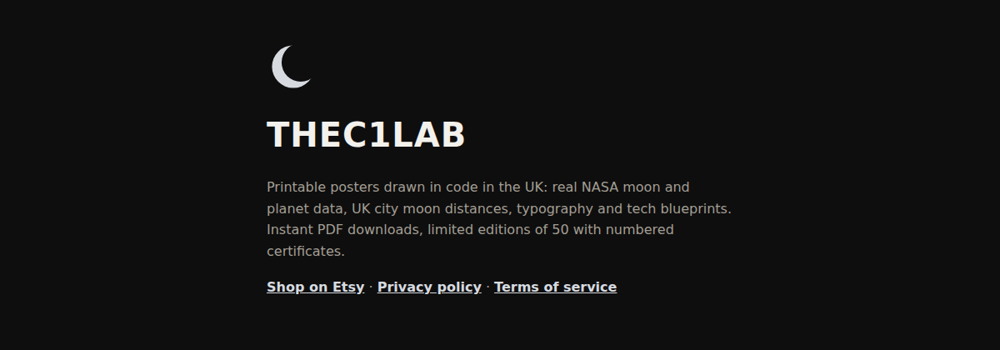
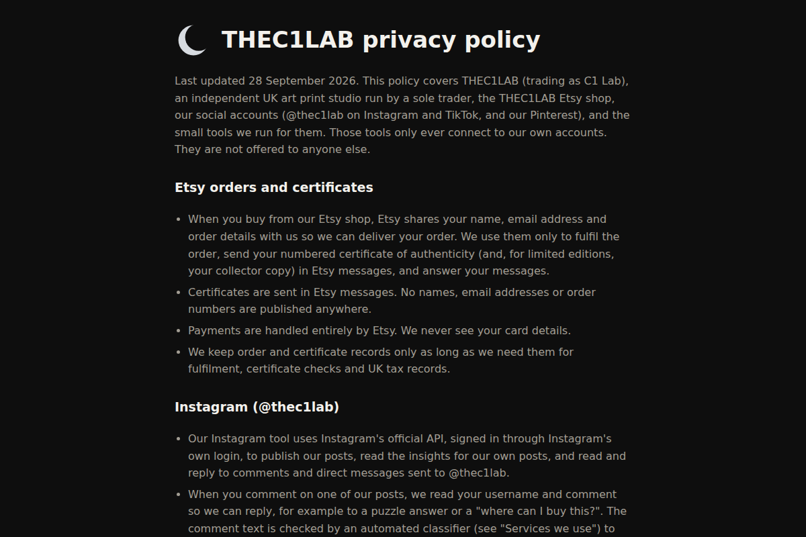

# THEC1LAB

The website for THEC1LAB, a UK studio making printable posters drawn in code: moon and planet data, UK city moon distances, typography and blueprints. This repo holds the site's home page, privacy policy and terms.



*The home page, `index.html`, as it renders. Live at [thec1lab.cn1-lab.uk](https://thec1lab.cn1-lab.uk/).*

All sales happen in the [THEC1LAB Etsy shop](https://www.etsy.com/shop/THEC1LAB). This site does not sell anything itself.

## What it does

- **Home page** (`index.html`): who THEC1LAB is, with links to the Etsy shop, the privacy policy and the terms.
- **Privacy policy** (`privacy.html`): what happens to your data when you buy on Etsy or comment on @thec1lab, the services used, and how to have your data deleted.
- **Terms of service** (`terms.html`): the personal-use licence on every design, limited editions and certificates, and the rules for our social accounts.
- **TikTok connect page** (`tiktok/index.html`): a one-job page used only when connecting the THEC1LAB TikTok account. It shows the address it was opened with so it can be copied. Opened any other way, it says there is nothing to copy.

## Screenshots



*`privacy.html`, top of the page. Same dark style as the home page.*

## Quick start

The site is plain HTML and CSS with no build step. To look at it on your own machine:

```bash
git clone https://github.com/casareanderson/thec1lab.git
cd thec1lab
python3 -m http.server 8000
```

Open <http://localhost:8000/>. The home page links to `privacy` and `terms` without `.html`, as GitHub Pages serves them. With the Python server, open `privacy.html` and `terms.html` directly.

## How it works

GitHub Pages serves the repo as it is. The `CNAME` file points the custom domain at it.

```
.
├── index.html         # home page
├── privacy.html       # privacy policy (last updated 28 September 2026)
├── terms.html         # terms of service (last updated 28 September 2026)
├── tiktok/index.html  # TikTok account connect page
├── CNAME              # custom domain for GitHub Pages
└── docs/              # README screenshots
```

To change the policy or terms, edit the HTML, update the "Last updated" date at the top, and push.

## Status and limits

- Live and serving: all four pages answered 200 on 8 October 2026.
- No analytics, cookies or tracking scripts. The only script on the site is the copy button on the TikTok page.
- The site has no shop, basket or sign-in. For orders, certificates or questions, message THEC1LAB on Etsy.

## Licence and credits

All rights reserved. The text and design of this site belong to THEC1LAB. The repo has no open-source licence.

If this is useful to you, [buy me a coffee](https://buymeacoffee.com/iamc_tech) ☕
